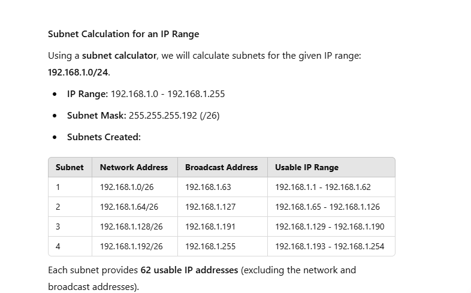

# Networking Fundamentals
> A practical guide to OSI model, subnetting, and TCP/IP protocols

This repository contains resources for understanding core networking concepts with practical examples and implementations.

## Contents

### 1. OSI Model Documentation
A comprehensive explanation of the seven layers of the OSI (Open Systems Interconnection) model with real-world examples for each layer:

- **Physical Layer**: Transmission of raw bit streams over physical media (cables, radio signals)
- **Data Link Layer**: Node-to-node data transfer with error detection (MAC addresses, Ethernet)
- **Network Layer**: Logical addressing and routing between networks (IP, routers)
- **Transport Layer**: End-to-end communication and reliability (TCP, UDP)
- **Session Layer**: Connection management between applications (session tracking)
- **Presentation Layer**: Data translation and encryption (SSL/TLS, media formats)
- **Application Layer**: User-facing network services (HTTP, DNS, SMTP)

The document explains how these layers interact when performing everyday networking tasks like browsing websites.

### 2. Subnet Calculator
#### Subnetting Calculation Using a Subnetting Calculator
- Given IP Range: 192.168.1.0/24
- Required Subnets: 4
- Subnet Mask: /26 (since 2^2 = 4 subnets)

#### Results:

- **Subnet 1**: 192.168.1.0/26

- Usable IP Range: 192.168.1.1 to 192.168.1.62

- Broadcast Address: 192.168.1.63

- **Subnet 2**: 192.168.1.64/26

- Usable IP Range: 192.168.1.65 to 192.168.1.126

- Broadcast Address: 192.168.1.127

- **Subnet 3**: 192.168.1.128/26

- Usable IP Range: 192.168.1.129 to 192.168.1.190

- Broadcast Address: 192.168.1.191

- **Subnet 4**: 192.168.1.192/26

- Usable IP Range: 192.168.1.193 to 192.168.1.254

- Broadcast Address: 192.168.1.255

**Each subnet supports 62 usable IP addresses, which is sufficient for dividing the network into smaller segments**.

### 3. TCP/IP Protocol Suite Analysis
An in-depth examination of how TCP/IP protocols operate across different layers when loading a web page:

- **Application Layer Operations**: DNS resolution, HTTP requests, TLS handshaking
- **Transport Layer Functions**: TCP connection establishment, flow control, reliability
- **Internet Layer Processing**: IP addressing, routing, fragmentation
- **Network Interface Transmissions**: Framing, physical signaling, media access

Includes explanation of modern optimization techniques like TCP Fast Open, CDNs, and advanced congestion control algorithms.

## Use Cases

These resources can be used for:

- Learning networking fundamentals
- Preparing for networking certifications
- Network design and planning
- Troubleshooting connectivity issues
- Understanding web application performance

### Getting Started

To use the subnet calculator:
```python
# Example usage
results = calculate_subnets("192.168.1.0", "/24", 4)
```

## Key Networking Principles

- **Layered Architecture**: Each layer has specific responsibilities, creating modular systems
- **Encapsulation**: Each layer adds its header information to data from higher layers
- **Protocol Independence**: Upper layers don't need to know details about lower layer implementations
- **Addressing Hierarchy**: Network addressing schemes use hierarchical structures for efficient routing

Whether you're designing networks, troubleshooting connectivity issues, or simply learning about how the internet works, understanding these fundamental concepts is essential for working with modern networked systems.

### Screenshot


